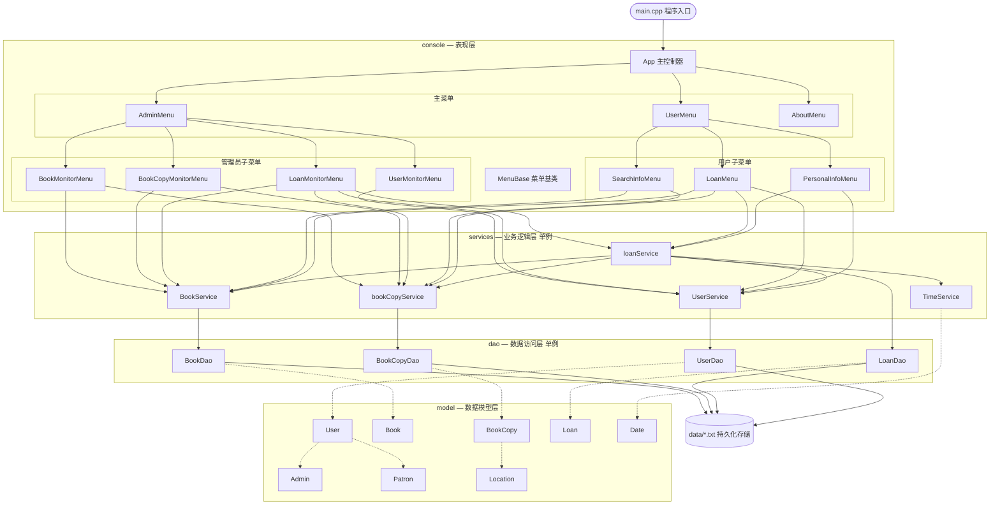

# 图书管理系统报告

## 系统需求分析

图书管理系统主要分为用户系统和管理员系统两大子系统。

根据任务书的要求，图书管理系统应该实现以下功能：

- 用户信息管理：存储用户信息，如用户姓名、借阅历史等。支持对用户的信息进行查询、增加、删除、修改等操作；
- 图书信息管理：存储图书信息，如书名、作者、类别、关键字、简介、借阅状态等。支持对图书的信息进行查询、增加、删除、修改等操作，且要求图书查询功能具有一定模糊查询的能力，例如用户输入一个字，可查询到包含该字的图书；
- 借还书记录管理：记录用户借还书的时间等信息、查看用户或图书的借阅历史等；
- 统计分析功能：根据借还书记录进行简单的统计分析，比如最受欢迎的书籍、借阅最多的用户、用户借阅量随时间的变化趋势等。可参考某些app的年度报告；
- 特殊情况处理：对非法输入等特殊情况进行合适的处理。

## 2 总体设计

### 功能模块设计

#### 管理员系统

管理员系统应该有以下几个模块，分别对应上述功能：

- 图书信息管理。这里的图书指的是抽象的图书，也即ISBN相同的书本都被视作同一本图书。将图书单独抽象出来，是因为同一ISBN的图书，其书名、作者、出版社等信息是相同的，这样可以方便统一管理，避免不同副本信息不同的问题。该模块有基础的增删改查功能。
- 图书副本信息管理。每一个副本对应一本具体的图书，唯一标识是馆藏码。同样实现增删改查。
- 用户信息管理。增删改查。用户分为读者和管理员两类。
- 图书借还记录管理。为了模拟真实的系统，管理员系统不进行借阅操作，而是只能对借阅记录进行查询。借阅记录是和其它模块高度相关的数据，如果可以随意改动，可能会导致系统的混乱。因此借阅记录被设置为只能由用户的真实操作生成。统计功能同样被放置在这里。

#### 用户系统

用户系统有以下模块：

- 图书信息查询。用户可以通过多种方式查询本馆的图书。还可以查看推荐信息，统计功能也被集成到这里。
- 图书副本信息查询。可以通过ISBN、地点等方式进行查询。
- 借阅系统。可以借阅、续期、归还图书，查询借阅记录。
- 个人信息管理。

## 3 详细设计

### 项目结构设计

本项目采取分层设计模式。主要分为以下层次：

- model层，负责定义数据模型。
- dao层，负责进行文件的读写和对象的序列化与解序列化。
- services层，负责处理核心的业务逻辑。
- console层，负责生成图形界面和用户交互，并将用户的输入构造为请求发给services处理。

另有data文件夹负责存放数据，CMakeLists.txt负责编译配置，main.cpp负责入口。

### 类和模块设计

#### 模块图

下图展示系统的分层架构及各模块之间的调用/依赖关系。箭头方向表示"调用方 → 被调用方"，虚线表示对数据模型的使用。



#### 类层次图

下图聚焦展示系统中的两个继承体系：菜单类层次和用户类层次。

```mermaid
classDiagram
    direction TB

    class MenuBase {
        <<abstract>>
        +displayMenu(string, vector) int
        +readLine(string) string
        +readInt(string) int
        +pause() void
        +clearScreen() void
        +printSeparator(char, int) void
    }
    class AdminMenu {
        +show()
    }
    class UserMenu {
        +show()
    }
    class AboutMenu {
        +show()
    }
    class UserMonitorMenu {
        +show()
        -displayAllUsers()
        -addPatron()
        -addAdmin()
        -updateUserInfo()
        -removeUser()
    }
    class BookMonitorMenu {
        +show()
        -searchBooks()
        -addBook()
        -updateBook()
        -deleteBook()
    }
    class BookCopyMonitorMenu {
        +show()
        -addBookCopy()
        -updateBookCopy()
        -cancelBookCopy()
        -removeBookCopy()
    }
    class LoanMonitorMenu {
        +show()
        -displayStatistics()
        -displayMostBorrowed()
        -displayMostActiveUsers()
    }
    class SearchInfoMenu {
        +show()
        -displayAllBooks()
        -searchBooks()
        -viewShelves()
    }
    class LoanMenu {
        +show()
        -borrowBook()
        -renewBook()
        -returnBook()
        -displayRecommendations()
    }
    class PersonalInfoMenu {
        +show()
        -displayPersonalInfo()
        -updatePersonalInfo()
        -changePassword()
        -deleteAccount()
    }

    MenuBase <|-- AdminMenu
    MenuBase <|-- UserMenu
    MenuBase <|-- AboutMenu
    MenuBase <|-- UserMonitorMenu
    MenuBase <|-- BookMonitorMenu
    MenuBase <|-- BookCopyMonitorMenu
    MenuBase <|-- LoanMonitorMenu
    MenuBase <|-- SearchInfoMenu
    MenuBase <|-- LoanMenu
    MenuBase <|-- PersonalInfoMenu

    class User {
        <<abstract>>
        #id: string
        #username: string
        #phone: string
        #email: string
        #password: string
        +getId() string
        +getUsername() string
        +setId(string)
        +displayInfo()*
    }
    class Admin {
        +displayInfo()
    }
    class Patron {
        -borrowLimit: int
        +getBorrowLimit() int
        +setBorrowLimit(int)
        +displayInfo()
    }

    User <|-- Admin
    User <|-- Patron
```



简单说几个有小巧思的类设计：

- 抽象图书和图书拷贝的分离。图书类只包含图书的基本信息，而图书拷贝类则包含馆藏码、位置和状态等信息。这样可以避免不同副本信息不同的问题，同时也方便了图书的统一管理。
- 抽象用户类。用户类被设计为抽象类，包含了所有用户的共有属性和方法，而管理员和读者则继承自用户类，分别实现了自己的特有方法。这样可以方便地对不同类型的用户进行管理，同时也提高了代码的可维护性。然而本项目中也存在不足，就是添加、删除、修改用户信息的功能没有被抽象到父类中，而是分别在管理员和读者类中实现了。如果将这些功能抽象到父类中，可以提高代码的可维护性。
- 界面通用基类。几乎所有菜单类都继承自MenuBase类，MenuBase类提供了一些通用的界面方法，如显示菜单、读取输入、暂停、清屏等。一些繁琐的操作，比如说过滤一些不合法的输入、格式化输出等，都可以在基类中统一处理。这样可以避免重复代码，提高代码的可维护性。这一建议还是AI给出的，让我大为受益。
- 服务类单例。应用了在程设小班辅导中学到的单例类，能够有效避免类重复初始化，以及更严重的比如数据主存错误等问题。同时可以将文件读写函数调用放在构造函数中调用。

#### UML类图

下图展示系统完整的类图，包含各类的属性、方法以及类之间的关系（继承、组合、依赖、关联）。

```mermaid
classDiagram
    direction TB

    %% ===== Model 层：值类型 =====
    class Date {
        -year: short
        -month: short
        -day: short
        +fromString(string) Date
        +today() Date
        +toString() string
        +toYearMonthString() string
        +operator+(int) Date
        +operator-(Date) int
        +operator==(Date) bool
        +operator<(Date) bool
    }

    class Location {
        -lib: string
        -floor: short
        -row: short
        -unit: short
        -level: short
        +toString() string
        +setLocation(string)
    }

    %% ===== Model 层：核心实体 =====
    class User {
        <<abstract>>
        #id: string
        #username: string
        #phone: string
        #email: string
        #password: string
        +getId() string
        +getUsername() string
        +getPhone() string
        +getEmail() string
        +setId(string)
        +setUsername(string)
        +displayInfo()*
    }

    class Admin {
        +displayInfo()
    }

    class Patron {
        -borrowLimit: int
        +getBorrowLimit() int
        +setBorrowLimit(int)
        +displayInfo()
    }

    class Book {
        -ISBN: string
        -Title: string
        -Author: string
        -Publisher: string
        -PublishingYear: int
        -Category: string
        -Remarks: string
        +getISBN() string
        +getTitle() string
        +setISBN(string)
        +setTitle(string)
    }

    class BookCopy {
        -ISBN: string
        -libCode: string
        -bookLocation: Location
        -status: bookstatus
        +getISBN() string
        +getLibCode() string
        +getBookLocation() Location
        +getStatus() bookstatus
        +setLibCode(string)
        +setStatus(bookstatus)
    }

    class Loan {
        -id: string
        -libCode: string
        -ISBN: string
        -userId: string
        -loanDate: Date
        -dueDate: Date
        -returnDate: Date
        -isReturned: bool
        +isOverdue() bool
        +getOverdueDays() int
        +setReturnDate(Date)
        +setIsReturned(bool)
    }

    %% ===== 继承 =====
    User <|-- Admin
    User <|-- Patron

    %% ===== 组合 / 依赖 =====
    BookCopy *-- Location : contains
    Loan ..> Date : uses

    %% ===== 关联（字符串外键） =====
    Book "1" --o "0..*" BookCopy : ISBN
    BookCopy "1" --o "0..*" Loan : libCode
    User "1" --o "0..*" Loan : userId

    %% ===== DAO 层 =====
    class BookDao {
        <<singleton>>
        +loadBooksFromFile(string) vector
        +saveBooksToFile(string, vector) bool
        -bookToString(Book) string
        -stringToBook(string) Book
    }
    class BookCopyDao {
        <<singleton>>
        +loadBookCopiesFromFile(string) vector
        +saveBookCopiesToFile(string, vector) bool
    }
    class LoanDao {
        <<singleton>>
        +loadLoansFromFile(string) vector
        +saveLoansToFile(string, vector) bool
    }
    class UserDao {
        <<singleton>>
        +loadUsersFromFile(string) vector
        +saveUsersToFile(string, vector) bool
    }

    BookDao ..> Book : serializes
    BookCopyDao ..> BookCopy : serializes
    LoanDao ..> Loan : serializes
    UserDao ..> User : serializes

    %% ===== Service 层 =====
    class BookService {
        <<singleton>>
        +books: vector
        +getInstance() BookService
        +addBook(Book) bool
        +removeBook(string) bool
        +updateBook(string, Book) bool
        +searchBooks(searchQuery) vector
        +getBookByISBN(string) Book
        +isBookValid(string) bool
        +readBooksFromFile() bool
        +writeBooksToFile() bool
    }

    class bookCopyService {
        <<singleton>>
        +bookCopies: vector
        +getInstance() bookCopyService
        +addBookCopy(BookCopy) bool
        +cancelBookCopy(string, string) bool
        +removeBookCopy(string, string) bool
        +updateBookCopy(string, string, BookCopy) bool
        +getBookCopyByLibCode(string) BookCopy
        +getBookCopiesByISBN(string) vector
        +isLibCodeAvailable(string) bool
        +readBookCopiesFromFile() bool
    }

    class loanService {
        <<singleton>>
        +loans: vector
        +getInstance() loanService
        +borrowBook(string, string, string, string) bool
        +returnBook(string, string, string, string) bool
        +renewBook(string, string, string, string) bool
        +returnBookByLibCode(string, string) bool
        +returnBooksByISBN(string, string) bool
        +getBorrowingBooksByUser(string) vector
        +getBorrowHistoryByUser(string) vector
        +getMostBorrowedBooks(int) map
        +getMostActiveUsers(int) map
        +getTotalBorrowVSMonth() map
        +readLoansFromFile() bool
    }

    class UserService {
        <<singleton>>
        +users: vector
        +currentUser: User
        +getInstance() UserService
        +addPatron(...) bool
        +addAdmin(...) bool
        +removeUser(string, string) bool
        +updatePatron(...) bool
        +updatePatronPassword(...) bool
        +getUserById(string) User
        +getUserByUsername(string) User
        +authenticate(string, string) User
        +encryptPassword(string, string) string
        +decryptPassword(string, string) string
        +readUsersFromFile() bool
    }

    class TimeService {
        <<singleton>>
        +DEFAULT_BORROW_DAYS: int = 30
        +RENEW_DAYS: int = 15
        +getInstance() TimeService
        +calculateDueDate(Date) Date
        +calculateRenewedDueDate(Date) Date
    }

    %% Service -> DAO
    BookService ..> BookDao : uses
    bookCopyService ..> BookCopyDao : uses
    loanService ..> LoanDao : uses
    UserService ..> UserDao : uses

    %% Service -> Service（跨服务协作）
    loanService ..> UserService : uses
    loanService ..> BookService : uses
    loanService ..> bookCopyService : uses
    loanService ..> TimeService : uses

    %% Service -> Model
    BookService ..> Book : manages
    bookCopyService ..> BookCopy : manages
    loanService ..> Loan : manages
    UserService ..> User : manages
    TimeService ..> Date : uses

    %% ===== Console 层 =====
    class MenuBase {
        <<abstract>>
        +displayMenu(string, vector) int
        +readLine(string) string
        +readInt(string) int
        +pause() void
        +clearScreen() void
        +printSeparator(char, int) void
    }

    class App {
        -loginFlow() bool
        -showLoginMenu() int
        -doLogin() bool
        -doRegister() void
        +run() void
        +About() void
    }

    class AdminMenu {
        +show()
    }
    class UserMenu {
        +show()
    }
    class AboutMenu {
        +show()
    }
    class UserMonitorMenu {
        +show()
        -displayAllUsers()
        -addPatron()
        -addAdmin()
        -updateUserInfo()
        -removeUser()
    }
    class BookMonitorMenu {
        +show()
        -searchBooks()
        -addBook()
        -updateBook()
        -deleteBook()
    }
    class BookCopyMonitorMenu {
        +show()
        -addBookCopy()
        -updateBookCopy()
        -cancelBookCopy()
        -removeBookCopy()
    }
    class LoanMonitorMenu {
        +show()
        -displayStatistics()
        -displayMostBorrowed()
        -displayMostActiveUsers()
    }
    class SearchInfoMenu {
        +show()
        -searchBooks()
        -viewShelves()
    }
    class LoanMenu {
        +show()
        -borrowBook()
        -renewBook()
        -returnBook()
        -displayRecommendations()
    }
    class PersonalInfoMenu {
        +show()
        -updatePersonalInfo()
        -changePassword()
        -deleteAccount()
    }

    MenuBase <|-- AdminMenu
    MenuBase <|-- UserMenu
    MenuBase <|-- AboutMenu
    MenuBase <|-- UserMonitorMenu
    MenuBase <|-- BookMonitorMenu
    MenuBase <|-- BookCopyMonitorMenu
    MenuBase <|-- LoanMonitorMenu
    MenuBase <|-- SearchInfoMenu
    MenuBase <|-- LoanMenu
    MenuBase <|-- PersonalInfoMenu

    %% App 调度菜单
    App ..> AdminMenu : creates
    App ..> UserMenu : creates
    App ..> AboutMenu : creates
    App ..> UserService : uses

    %% 菜单分发
    AdminMenu ..> UserMonitorMenu : dispatches
    AdminMenu ..> BookMonitorMenu : dispatches
    AdminMenu ..> BookCopyMonitorMenu : dispatches
    AdminMenu ..> LoanMonitorMenu : dispatches
    UserMenu ..> SearchInfoMenu : dispatches
    UserMenu ..> LoanMenu : dispatches
    UserMenu ..> PersonalInfoMenu : dispatches

    %% 菜单 -> Service
    UserMonitorMenu ..> UserService
    BookMonitorMenu ..> BookService
    BookMonitorMenu ..> bookCopyService
    BookCopyMonitorMenu ..> bookCopyService
    LoanMonitorMenu ..> loanService
    SearchInfoMenu ..> BookService
    SearchInfoMenu ..> bookCopyService
    LoanMenu ..> loanService
    LoanMenu ..> UserService
    PersonalInfoMenu ..> UserService
    PersonalInfoMenu ..> loanService
```



## 4 系统调试

vs code中的断点调试和copilot等功能为本次大作业的调试带来了非常多的便利。以下讲述我在调试过程中遇到的几个小插曲：

- 重复加密bug：
  - 用户密码加密流程。本系统的密码加密方式采用简单的异或加密，其加密密钥为用户的id。
  - 修改用户信息时的流程是：先删除原有用户，再添加新用户。在不对密码进行修改时，系统会调用用户类的getter()方法获取原有密码。出于安全的考虑，getter()方法返回的密码是加密后的密码，这就导致在添加新用户时，这一加密后的密码又被加密了一次，导致用户无法登录。
  - 解决方案：严格划清加密值和明文值的边界。这可以体现在userservice.h中，添加用户和修改密码的方法中，传入的密码参数必须是明文值，其形参被命名为const std::string& plainPassword.这样明文的密码只会在用户输入时出现，程序内部从service层往下直到数据文件都是加密值。
  - 那么getter()只能返回加密值，service层只能接受明文值，如何转换？答案就是不转换，把updatePatron和updatePatronPassword分为两个独立的函数。updatePatronPassword接收用户输入的明文值，加密后存储；updatePatron直接从getter()获得加密值，直接存储。这样就避免了重复加密的问题。
- 信息存储冗余
  - 我们有Book类和BookCopy类，前者对应抽象的图书，后者对应具体的图书。那么，如何通过BookCopy寻找到存储在Book中的书名、作者等信息？又如何通过一个Book就查找到它所有的副本？这是一个经典的一对多问题。在设计初期，我们采用的方案是：Book类中有成员std::vector\<BookCopy\> copies，读取它就可以获知副本信息。BookCopy中有成员std::string ISBN，通过它也能查询到相对应的图书信息。但这样做的弊端就是，如果两个信息对不上，比如copies里面没有但是ISBN确实是它，那就不好了。
  - 解决的方案是删除copies成员，在bookcopyservice中实现std::vector\<BookCopy\> getBookCopiesByISBN(const std::string& isbn) const;需要找副本直接到这里。
  - 同样带来了新的问题：本系统中的馆藏甚至不超过1000件，但实际的图书馆馆藏数量庞大（清华大学图书馆有625万件实体馆藏），经不起这样逐本遍历。这种情况又该怎么办呢？不知道。
- 神秘空指针
  - 请看以下代码：

``` C++

void LoanMenu::borrowBook() {
    std::cout << "\n=== 借阅图书 ===" << std::endl;
    std::string libCode = readLine("请输入图书副本编号: ");

    User* user = UserService::getInstance().getCurrentUser();
    std::string userId = user ? user->getId() : "";
    BookCopy* copy = bookCopyService::getInstance().getBookCopyByLibCode(libCode);
    std::string ISBN = copy ? copy->getISBN() : "";
    std::string errorMessage;

    std::cout <<"您是"<< user->getUsername() << "，ID: " << userId << std::endl;
    std::cout <<"您要借阅的图书副本编号是: " << libCode << "，对应ISBN: " << ISBN << std::endl;
    std::cout <<"书名为: " << BookService::getInstance().getBookTitleByISBN(ISBN) << std::endl;
    std::cout <<"请确认是否继续借阅？(y/n): ";
    std::string confirm = readLine("");
    if (confirm != "y" && confirm != "Y") {
        std::cout << "借阅操作已取消。" << std::endl;
        pause();
        return;
    }

    if (loanService::getInstance().borrowBook(userId, ISBN, libCode, errorMessage)) {
        std::cout << "借阅成功！" << std::endl;
    } else {
        std::cout << "借阅失败: " << errorMessage << std::endl;
    }
    pause();
}
```

- 当用户在注销自己后，currentUser就是nullptr了。此时进入借书页面，进行借书，就会对它进行解引用，导致程序崩溃。后来加入了判空就好了。
- 关于空指针，过程中还出现了一处代码
delete *it;
writeUsersToFile();
\*it = new Patron(id, username, phone, email,(\*it)->getPassword(), borrowLimit);
可以说AI确实写不出这种释放完立刻解引用的抽象代码，人类无法取代AI的原因找到了（？）

- 编译问题
  - 由于本项目采用了CMake构建，而且初期创建项目用的是Qt（想着整个图形化界面，但是因为发现太过困难就放弃了），导致编译逻辑非常混乱，Qt、vsc、VS，这三个同时至多只能有一个能跑。放弃Qt之后，我把它改为了纯C++程序，删掉了所有的编译配置和构建产物。
  - 我拜托AI写了cmakelists.txt，这样在vsc和vs上都可以有效地运行了。

## 5 结果分析

### 未能解决的问题

- 很多信息都是依靠主键进行查找的，比如说在查询记录时，会根据ISBN找图书信息，根据userId找用户信息。那么对于用户注销、删除等情况，找不到这件事会不会带来显示空白、乃至于程序崩溃等复杂问题？解决方案是什么？是在所有地方都加上指针判空（那信息缺失怎么办？），还是在注销时只标注特殊状态而不进行删除？（事实上在本系统中，图书副本就是推荐注销而非删除的）
- 用户是读者还是管理员？在本系统中，这是由user.txt中的第一个字段决定的。也就是说，你注册一个普通账户，然后把第一个字段改一下，就可以提权了……难绷。然而似乎没有比较好的方案，除非我把文件改成二进制文件，或者把admin/patron也加密储存或作为加密密钥的一部分。
- services中的各项服务会相互调用。比如说loanservice就引用了其余的所有service。那如果对于更加复杂的系统，如何避免“你引用我，我引用你”的复杂结构，以及可能的循环调用？

## 6 总结
